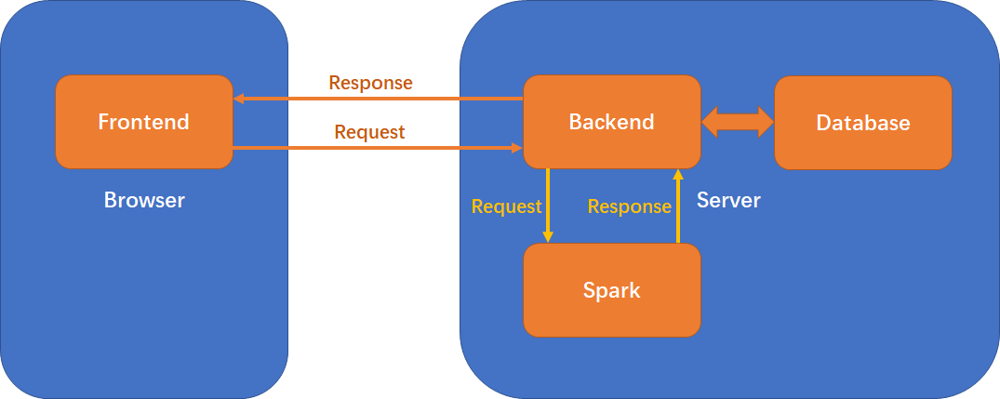
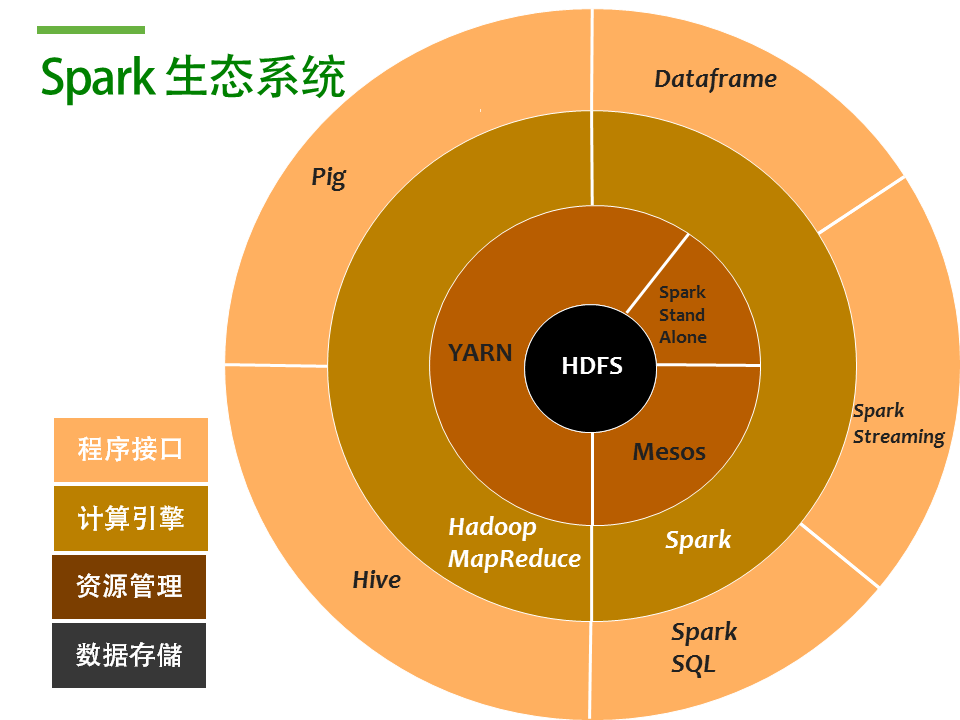
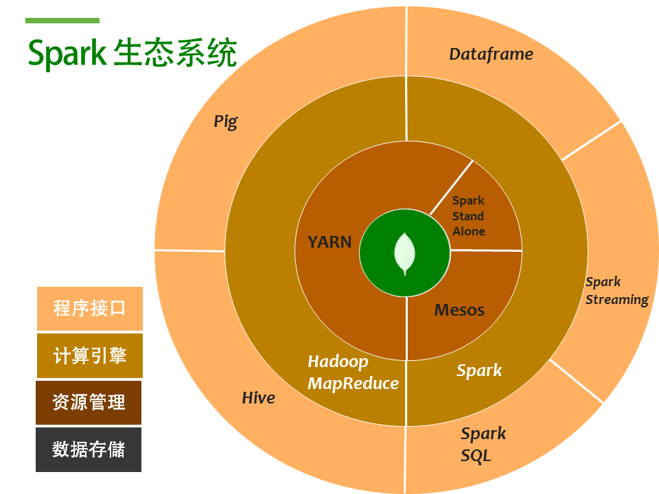
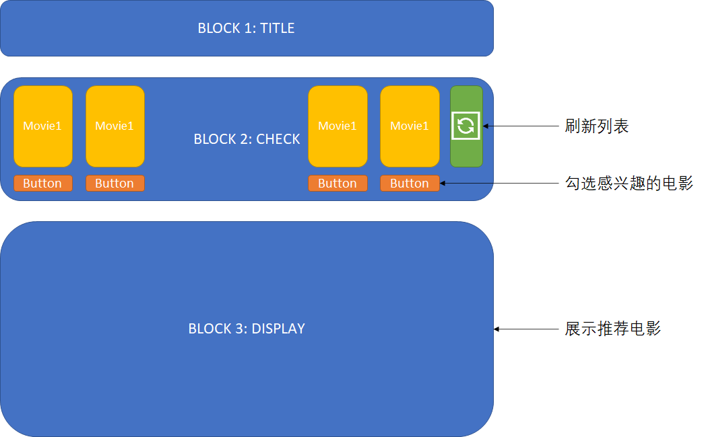
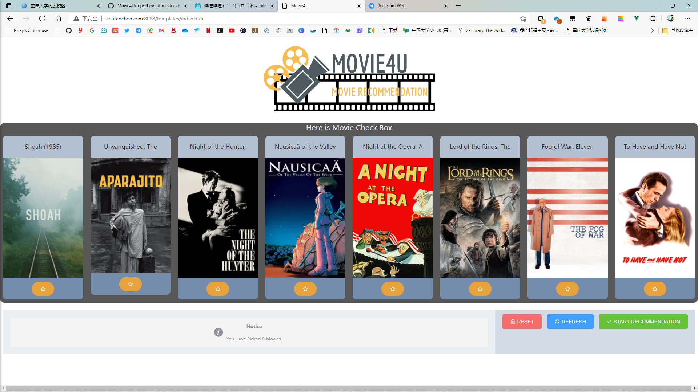
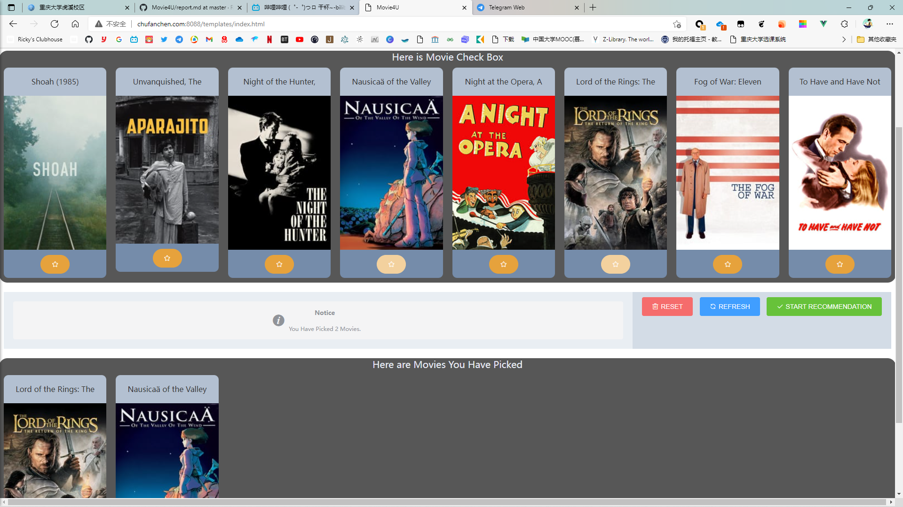
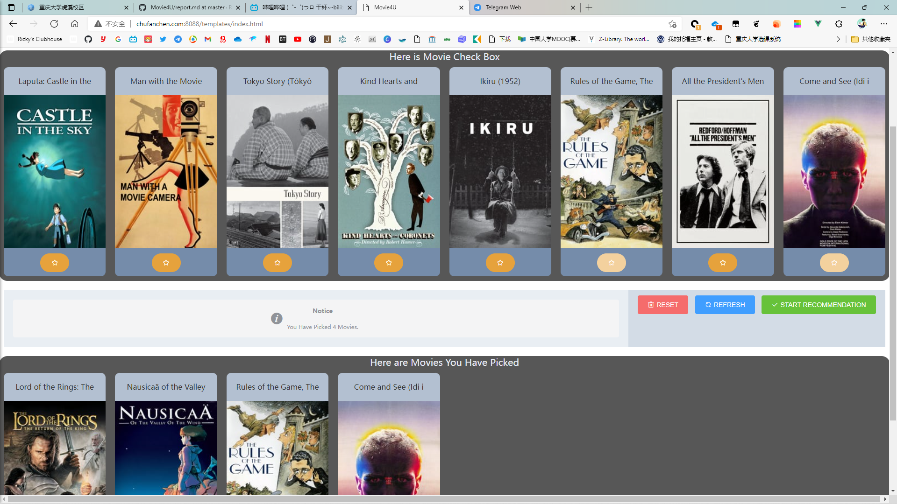
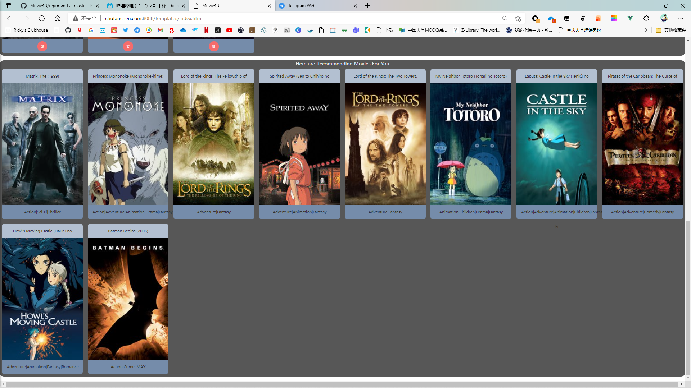
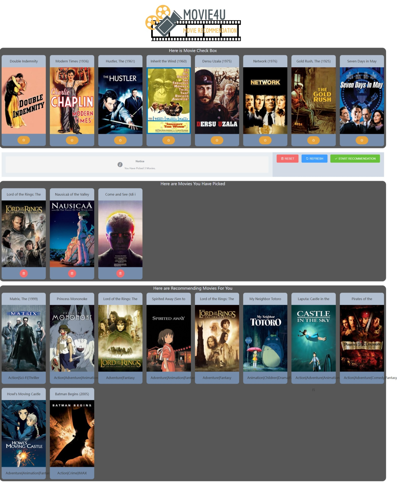

# 项目设计报告

**报告注意事项**：
1. 问题分析与抽象，解决方案
2. 设计系统结构，确定软硬件组成，确定系统边界
3. 项目社会、健康、安全、法律、文化以及环境等可行性分析
4. 技术规范标准适用分析，确定系统的主要技术指标
5. 项目实施对法律、安全、健康、伦理与文化所产生的潜在影响分析及解决方案
6. 团队成员职责分工与协调组织
7. 软硬件选型的技术与经济性分析

## 项目背景介绍
> 国内外研究现状，项目拟解决的问题，现有解决方案

&emsp;&emsp;随着网络碎片化时代的到来，电影平台的用户数据量呈现指数式的增长，大多数用户在面对这样海量的数据时，显得手足无措，不知道该如何选择，这促使了基于用户的个性化智能影片推荐系统的发展，电影推荐系统不仅为观众提供了所需的电影，还增强了用户的体验感。推荐系统可以有效解决信息过载的问题，对用户而言，它可以快速地为用户挑选出符合用户特点的物品；对内容而言，它帮助内容更快更好地推送到喜爱它的用户手上；对网站而言，它帮助网站更有效地保留用户资源。  
&emsp;&emsp;电影推荐系统的基本原理是根据用户的历史行为，对用户可能感兴趣的信息进行预测和推荐，将用户主动搜索的方式转化为由系统自动推送其可能感兴趣的内容的方式，为用户提供更智能化、更个性化的推荐服务。电影推荐系统旨在替用户进行个性化的决策，虽然推荐的内容并非由用户亲自选择，但推荐系统通常能为用户提供高质量和高效率的推荐。  
&emsp;&emsp;推荐系统经过了十几年的发展，已经较为成熟，并且在各个领域都有应用，如图书推荐、新闻推荐、视频和电影推荐等。但仍存在许多不足需要改进，如推荐算法的选择以及推荐的实时性等。国外的电影推荐系统，最早可以追溯到GroupLens项目组的研究，他们通过MovieLens网站，收集了大量的用户评价、评分数据，并基于这些数据设计推荐系统向用户提供电影推荐服务。国内的电影推荐系统，如爱奇艺、优酷和腾讯视频的做法是将电影作为一个视频类型，同时提供了推荐服务，但推荐的电影大多是对整个平台而言的热门电影，割裂了与用户的联系，推荐的电影个性化不足。而以豆瓣为代表的电影平台，采取的主要是对相关电影的推荐，缺少一定的针对性。

## 需求分析
> 分析系统在数据处理、数据存储和功能方面的需求

### 功能性需求

#### 用户需求

对于一般用户而言，通过该推荐系统应能实现以下功能：

1. 选取自己感兴趣的电影，并能对已选取的电影进行删除和重新选取操作
2. 通过选取的电影获取到推荐的电影列表

#### 产品需求

为实现用户的需求，产品方面应做到以下功能：

1. 能提供电影列表给用户进行选取，能接受用户的增删操作
2. 能接受用户选取的列表进行推荐并返回推荐电影列表展示给用户
3. 能够具备处理和存储 MovieLens Latest 数据集的能力
4. 能够在用户可以接受的时间内完成推荐引擎的推理

### 非功能性需求

其他非必要的非功能性需求如下：

1. 用户可以对电影的信息（如演职员表，电影分类，电影链接）进行查看
2. 可以通过注册和登录功能实现对用户以往感兴趣电影列表的记录
3. 绘制用户画像并实现可视化

### 设计约束

该产品设计或实现方案上的约束主要如下：

| 功能               | 技术约束                             | 功能约束                   |
| ------------------ | ------------------------------------ | -------------------------- |
| 前端 Web 页面      | 使用 Vue 框架加 ElementUI 组件库实现 | 通过后端与推荐引擎交互     |
| 后端               | 使用 Flask 实现                      | 对于前端请求只做 CRUD 操作 |
| 数据处理与推荐引擎 | 使用 Spark 实现                      | 仅接受本地 GET 请求        |
| 数据存储           | 使用 MongoDB 实现                    | 能做到数据集信息完全存储   |

### 可行性分析

## 系统设计
> 系统的功能设计。系统如何存储数据，这样存储的目的是什么？系统处理大数据的方案是什么？分析推荐系统算法的时间复杂度、空间复杂度和实际运行时间

### 系统架构
整个系统的开发与部署是前后端分离的，前端与后端可以分开部署在不同平台，后端会对前端请求进行筛选与过滤，再进行查表操作或发送推荐请求给 Spark，同时后端与 Spark 的通信仅开放给本地（防止DDos）。整个项目的系统架构可以参照下图：



### 数据存储与处理（如何存储&目的，处理方案）

数据存储主要通过导入`ml-latest`中各`*.csv`表，存储在MongoDB中

**选择MongoDB**：鉴于数据量过大，`RDBMS`并不能适应这个量级，转向使用非关系数据库。而算法采用`Spark`平台进行运算，其原生支持`HDFS`来管理大规模非结构化数据



而`MongoDB`协同`Spark`时就可以充当`HDFS`的角色，提供计算的原始数据，以及分析计算结果



此外，`MongoDB`已经为[map-reduce](https://docs.mongodb.com/manual/core/map-reduce/ )做了设计，在响应时间上也优于`HDFS`


**原始数据collection格式**：

`genome-scores collection`

| 字段名    | 解释               | 类型    |
| --------- | ------------------ | ------- |
| _id       | 主键               | Object |
| movieId   | 电影标识符         | Int32   |
| tagId     | 标签标识符         | Int32   |
| relevance | 电影关于标签相关度 | Double  |

`genome-tags collection`

| 字段名 | 解释       | 类型    |
| ------ | ---------- | ------- |
| _id    | 主键       | Object |
| tagId  | 标签标识符 | Int32   |
| tag    | 标签名称   | String  |

`movie collection`

| 字段名  | 解释                                           | 类型    |
| ------- | ---------------------------------------------- | ------- |
| _id     | 主键                                           | Object |
| movieId | 电影标识符                                     | Int32   |
| genres  | 电影类型                                       | String  |
| title   | 电影名称                                       | String  |
| url     | 电影海报链接，格式"http://example/moiveId.jpg" | String  |

`rateing collection`

| 字段名  | 解释           | 类型    |
| ------- | -------------- | ------- |
| _id     | 主键           | Object |
| userId  | 用户标识符     | Int32   |
| movieId | 电影标识符     | Int32   |
| rating  | 用户对电影打分 | Double  |

**后续生成collection格式**：

`similarities collection` 电影之间相似度集合

| 字段名    | 解释                 | 类型   |
| --------- | -------------------- | ------ |
| movieId_1 | 电影一               | Int32  |
| movieId_2 | 电影二               | Int32  |
| value     | 电影一与电影二相关度 | Double |

`hot_movie_on_unique_tag collection` 单标签热门电影集合

| 字段名   | 解释                                           | 类型        |
| -------- | ---------------------------------------------- | ----------- |
| _id      | 电影标识符                                     | Int32       |
| title    | 电影名称                                       | Double 数组 |
| tag_id   | 标签标识符                                     | Int32       |
| tag_name | 标签名称                                       | String      |
| url      | 电影海报链接，格式"http://example/moiveId.jpg" | String      |

### 算法分析

&emsp;&emsp;推荐系统的基本思想是利用用户和物品的特征信息，为用户推荐那些具有用户喜欢的物品的特征的物品。如根据用户喜欢的物品，为其推荐与用户喜欢的物品相似的物品，或者为用户推荐与他喜好类似的用户喜欢的物品。  
&emsp;&emsp;Tapestry邮件过滤系统是最早的推荐系统，此后研究者们陆续提出了基于协同过滤的推荐算法、基于内容的推荐算法、基于关联规则的推荐算法以及基于多种规则的混合推荐算法。而基于协同过滤的推荐算法是目前实际生产环境中应用最多最广泛的推荐算法，协同过滤算法主要分为三种，第一种是基于用户的协同过滤算法（userCF），第二种是基于物品的协同过滤算法（itemCF），第三种是基于模型的协同过滤算法（modelCF）。基于用户的协同过滤主要考虑的是用户之间的相似度，找出相似用户喜欢的物品，并预测目标用户对于对应物品的兴趣度，再根据兴趣度进行推荐。基于物品的协同过滤的原理类似，只不过此时寻找的是物品间的相似度。而基于模型的协同过滤，是运用机器学习建模来解决推荐问题，可使用的算法也非常多，如关联算法、聚类算法、分类算法、回归算法、矩阵分解和神经网络等等。  
&emsp;&emsp;本电影推荐系统的推荐算法采用基于物品的协同过滤（itemCF）。该算法的基本原理是根据用户的历史物品选择记录，计算这些物品和其他物品之间的相似度，再根据相似度计算出该用户对其他物品的兴趣度。对于本电影推荐系统，也就是根据用户对电影的评分记录和这些电影与其他电影的相似度计算出该用户对其他电影的兴趣度，最终根据兴趣度高低来为该用户推荐电影。设喜欢电影<sub>a</sub>的用户人数为$N(a)$，喜欢电影<sub>b</sub>的用户人数为$N(b)$，则电影<sub>a</sub>与电影<sub>b</sub>之间相似度的计算方法为：
$$
Sim_{ab}=\frac{|N(a)\bigcap N(b)|}{|N(a)|}
$$

该公式体现了喜欢电影<sub>a</sub>的用户中同时也喜欢电影<sub>b</sub>的比例，该比例越高，则表示电影<sub>a</sub>和电影<sub>b</sub>越相似。但这个公式存在一些问题，当电影<sub>b</sub>在用户中非常热门时，那么几乎所有电影和电影<sub>b</sub>的相似度都会接近1。所以为了避免这种情况，需要对该公式做出如下改进：

$$
Sim_{ab}=\frac{|N(a)\bigcap N(b)|}{\sqrt{|N(a)||N(b)|}}
$$

在得到电影之间的相似度后，就可以根据用户的历史观影行为进行电影推荐了。用如下公式计算用户<sub>u</sub>对电影<sub>b</sub>的兴趣度：

$$
Pub=\sum_{a\in N(u)\bigcap S(b,K)}Sim_{ab}\cdot R_{ua}
$$
其中$Sim_{ab}$代表电影<sub>a</sub>与电影<sub>b</sub>的相似度。$R_{ua}$代表用户<sub>u</sub>对电影<sub>a</sub>的兴趣度，该值可以根据用户<sub>u</sub>对电影<sub>a</sub>的评分等数据进行计算。$N(u)$代表用户<sub>u</sub>喜爱的电影集合。$S(b,K)$代表与电影<sub>b</sub>最相似的K个电影。  
最终计算出用户对其他所有可能感兴趣电影的兴趣度，为用户推荐兴趣度最高的10个电影。


数据冷启动处理：

前端热门电影选择处理，由于`hot_movie_on_unique_tag ` 最终形成`369`部与其单标签相关度`>0.9`且用户评分`>4.0`电影，为确保用户刷新尽可能不出现重复电影，采用8部一批，通过切片时间，返回各自独立区间的电影集合。查询中使用`skip`划定区间，`limit`限制选择电影数量

```python
second = time.localtime().tm_sec % 46  # 数据集369，分为最多46组
hot_movie_list = col.find().skip(second * LIMIT_LEN).limit(LIMIT_LEN)
```

### 前端设计

#### 原型设计

首先针对用户的几个需求，设计原型图如下：



将整个页面分为了3个Block去实现

#### 具体实现

对于每个 Block 中涉及电影展示的部分，均通过 ElementUI 的布局组件实现，又因为 Vue 是数据驱动的，所以对于前台要展示的数据只需要通过 `v-bind` 与 `main.js` 中 Vue 的实例的数据绑定即可，这样每一个展示区块中都可以通过 `v-for` 去遍历数据并渲染对应的元素（以每行8个的形式）。而对于每一个电影的展示部分，可以通过 ElementUI 的 `container` 实现，每一个电影栏实际都是由包括了标题和海报的 Header 以及包括了按钮的 Footer 组成的，海报使用 `fill` 属性填充 `container`。

所有按钮（包括添加、删除、重置、刷新、开始推荐）通过 `@click` 与 js 中的 methods 对应，添加按钮的状态由一个布尔列表 disabled 保存，当他们置为 true 的时候表示当前电影已经添加过，不能重复添加，并会将按钮置为禁用状态。

前端与后端的所有请求均通过 Axios 实现，这是一个支持异步的请求模块，对于所有需要的请求，均会封装成对应的格式，通过 POST 或 GET 发送给后端，请求格式大致如下：

```javascript
axios
    .post(url, params) // 表示post方法向url发送带有params参数的请求，参数为json格式
    .then((response) => {
    // 在这里执行接受相应后的代码
})
    .catch(function (error) {
    console.log(error);
});
```

### 后端设计

作为对前端，spark中间件，完成对数据格式的整理与对数据库的一些操作

**数据库信息预处理**：参照MongoDB聚合(`aggregate`)运算

- 更新`movie`表图片url列
- 统计电影均分
- 统计各tag下相关度`>0.9`且均分`>4.0`的电影集合
- 关联各表，形成对应单一标签的热门高分电影集合

**冷处理热门电影推荐**：

- 前端发送 `localhost:/init` GET请求
- 返回数据库中预处理后`hot_movie_on_single_tag`集合信息，按时间分组每次8条

**对用户电影推荐**：

- 前端发送 `localhost:/recommend` POST请求
- 发送对本地spark端口请求，得到电影id列表
- 访问数据库，为电影id列表补全标题、类型、图片URL信息
- 按格式返回给前端信息


## 系统展示
> 描述系统的实现效果，如何使用该系统？
整个系统的功能展示以及操作步骤主要如下：

1. 用户通过点击 Check Box 中的关注按钮将感兴趣的电影加入兴趣列表中





2. 用户通过点击刷新按钮更新候选列表，然后继续选取电影



3. 用户可以通过点击已选电影栏中的删除按钮将电影从兴趣列表中移除


4. 选好电影后，点击推荐按钮，将开始电影的推荐；当推荐结束时将推荐列表展示给用户



最终整个页面展示如下：



## 总结
> 每位同学针对自己所做的工作写一段总结，整个项目写一段总结并对每位同学所做的贡献作出说明

### 个人总结（这部分需要每个人写一段）

#### WR

#### CCF

学习并搭建了MongoDB, Apache Spark集群。使用PySpark Dataframe API编写推荐算法(spark/similarities/)，使用flask+cherrypy搭建后端。使用Spark MLlib ALS模型建立uFeature和iFeature矩阵，使用tensorflow模型进行调参，最后使用Horovod进行分布式训练和预测(spark/Scalable Movie Recommendations.ipynb)。

#### JNR

本次项目了解了MongoDB的使用，学习了NoSQL的一些语法，从一开始尝试写`map-reduce`到发现已经在5.0弃用，转用`aggregation`处理数据，对BSON格式有了进一步了解。此外使用pymongo连接了MongoDB，使用flask对接了前端和spark，进行了访问数据库和数据格式整理。

#### SY

### 项目总结

## 参考文献
> 不少于10篇中英文参考文献，并且在报告正文中按照学术规范予以正确的标注。不得列入正文中没有引用的参考文献
