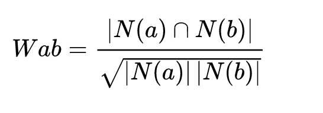

# 项目设计报告

## 项目背景介绍
随着网络碎片化时代的到来，电影平台的用户数据量迅速增长，促使了基于用户的个性化智能影片推荐系统的发展，电影推荐系统不仅为观众提供了所需的电影，还增强了用户的体验感。推荐系统可以有效解决信息过载的问题，对用户而言，它可以快速地为用户挑选出符合用户特点的物品；对内容而言，它帮助内容更快更好地推送到喜爱它的用户手上；对网站而言，它帮助网站更有效地保留用户资源。  
电影推荐系统根据用户的历史行为，对用户可能感兴趣的信息进行预测和推荐，将用户主动搜索的方式转化为由系统自动推送其可能感兴趣的内容的方式，为用户提供更智能化、更个性化的推荐服务。
## 需求分析

## 系统设计

### 数据存储与处理（如何存储&目的，处理方案）

### 算法分析
推荐系统的基本思想是利用用户和物品的特征信息，为用户推荐那些具有用户喜欢的物品的特征的物品。如根据用户喜欢的物品，为其推荐与用户喜欢的物品相似的物品，或者为用户推荐与他喜好类似的用户喜欢的物品。本系统的推荐算法采用基于物品的协同过滤（itemCF）。该算法的基本原理是根据用户的历史物品选择记录，计算这些物品和其他物品之间的相似度，再根据相似度计算出该
用户对其他物品的兴趣度。对于本电影推荐系统，就是根据用户对电影的评分记录和这些电影与其他电影的相似度计算出该用户对其他电影的兴趣度，最终根据兴趣度高低来为该用户推荐电影。  
电影间相似度的计算方法为：  
设喜欢电影a的用户人数为N(a)，喜欢电影b的用户人数为N(b),则电影a与b之间的相似度为

该公式体现了喜欢电影a的用户中同时也喜欢电影b的比例，该比例越高，则表示电影a和电影b越相似。但这个公式存在一些问题，如果说电影b在用户中非常热门，那么几乎所有电影和电影b的相似度都会接近1。所以为了避免这种情况，需要对该公式做出如下改进：

得到电影之间的相似度后，就可以根据用户的历史观影行为进行电影推荐了。用如下公式计算用户对电影b的兴趣度：

通过计算用户对其他所有可能感兴趣电影的兴趣度，为用户推荐兴趣度最高的10个电影。

## 系统展示

## 总结

## 参考文献